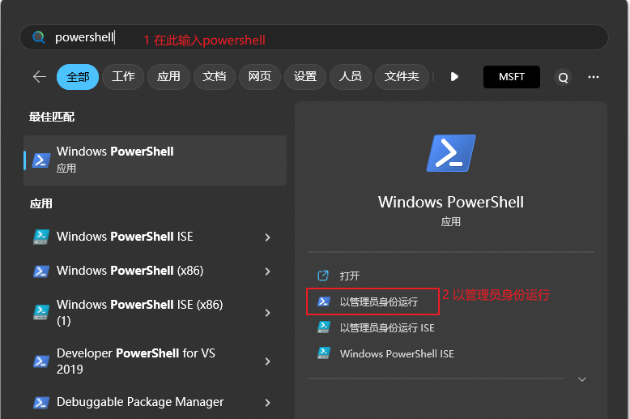
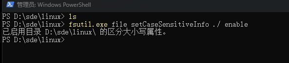
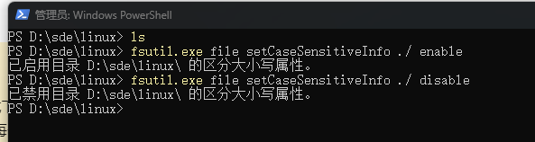

## Windows下开启区分大小写属性


### 检查当前区分大小写

打开powershell



进入想要查询的目录：

```powershell
cd d:/sde/linux
```

查询当前目录是否开启区分大小写

```powershell

fsutil.exe file queryCaseSensitiveInfo ./
```

### 开启区分大小写属性

```powershell
fsutil.exe file setCaseSensitiveInfo ./ enable
```



### 禁用区分大小写属性

```powershell
fsutil.exe file setCaseSensitiveInfo ./ disable
```



---

### 注意

****区分大小写的继承性****

创建新目录时，这些目录将从其父目录继承区分大小写

****错误：目录不为空****

不能更改包含其他文件或目录的目录上的区分大小写设置。 尝试创建一个新目录，更改设置，然后将混合大小写文件复制到该目录中。

> 参考：[区分大小写 | Microsoft Learn](https://learn.microsoft.com/zh-cn/windows/wsl/case-sensitivity)