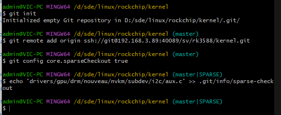
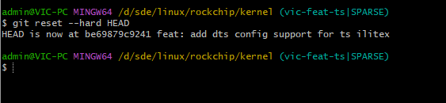

## 解决error: invalid path 'i2c/aux.c'问题


### 问题

问题：`aux`是windows“保留”文件名，不能使用，因为1974年做出的选择并兼容。

除了`aux`还有一下不可使用：

```powershell
CON, PRN, AUX, NUL, COM1, COM2, COM3, COM4, COM5, COM6, COM7, COM8, COM9, LPT1, LPT2, LPT3, LPT4, LPT5, LPT6, LPT7, LPT8, and LPT9
```

### 解决方案

- 创建空文件夹
- git初始化
- 添加远程仓库地址
- 设置本地git库开启`spares-checkout`
- 在`.git/info/spares-checkout`添加忽略`drivers/gpu/drm/nouveau/nvkm/subdev/i2c/aux.c`
- 拉取远程库至本地

### 解决方法

- 初始化本地仓库`git init`
- 添加远程仓库地址`git remote add origin <url>`
- 开启sparse-checkout `git config core.sparseCheckout true`
- `~~echo 'drivers/gpu/drm/nouveau/nvkm/subdev/i2c/aux.c' >> .git/info/sparse-checkout~~`
- 在`.git/info/`创建`sparse-checkout`文件并添加一下内容
  
    ```powershell
    *
    !drivers/gpu/drm/nouveau/nvkm/subdev/i2c/aux.c
    ```
    
- `git fetch`
- `git reset --hard HEAD`





---

### 历史问题

在UNIX中，一切皆文件(”everything is a file”)。

现在类UNIX系统中，如Linux也是如此。

硬件设备在特殊路径上表示。如`/dev/lp0`表示第一台打印机。`/dev/tty`表示控制台。

在1974年，这个概念被加入到**CP/M(Control Program for Microcomputers或者Control Program/Monitor)操作系统**中。而CP/M是为了内存特别小且没有硬盘的计算机设计的微型操作系统。它使用多个磁盘，没有目录，所以那些代表设备的特殊文件出现在每个磁盘上。

所以当你保存一个文本文件时，你可以告诉你的文本编辑器把它保存到打印机设备上，这样接可以打印了。但文本编辑器和其他程序喜欢添加文件扩展名，如“txt”，所以CP/M只是忽略了这些设备文件的文件扩展名。

微软的MS-DOC为了用户快速适应。采用了CP/M的特色，一直延续至今！！！

Windows95，建立在DOC之上。

Windows NT并不是基于DOC却它希望能够兼容Windows95

Windows10基于Windows NT，那它的工作方式也是这样。

> 参考
>
>
> windows历史问题：[Windows 10 Still Won’t Let You Use These File Names Reserved in 1974 (howtogeek.com)](https://www.howtogeek.com/fyi/windows-10-still-wont-let-you-use-these-file-names-reserved-in-1974/)
>
> windows官方文档：[Naming Files, Paths, and Namespaces - Win32 apps Microsoft Learn](https://learn.microsoft.com/en-us/windows/win32/fileio/naming-a-file)
>
> 解决思路：[gitlab - how to restore head after git clone? tried searching everywhere - Stack Overflow](https://stackoverflow.com/questions/67683085/how-to-restore-head-after-git-clone-tried-searching-everywhere)
>
> 解决方法：
>
> 1. [windows - Git pull error: unable to create file (Invalid argument) - Stack Overflow](https://stackoverflow.com/questions/26097568/git-pull-error-unable-to-create-file-invalid-argument/34515900#34515900)
> 2. [Git clone all but one file or folder, possible? - Stack Overflow](https://stackoverflow.com/questions/14700896/git-clone-all-but-one-file-or-folder-possible/14701421#14701421)
> 3. [Github issues](https://github.com/uvdl/linux-fslc/issues/1)
>
>    